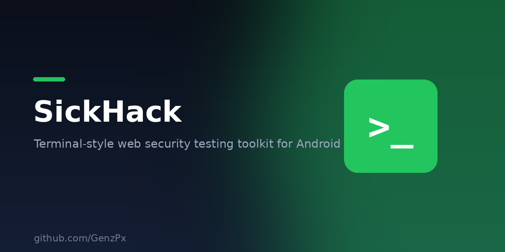

<p align="center">
  
</p>

# >/ SickHack

**Terminal pentest toolkit for Android** — by **GenzPX**.

SickHack adalah aplikasi Android bergaya *terminal hacker* (hijau `#00FF41` di atas hitam kehijauan `#0A0F0A`, font monospace) berisi toolkit pengujian keamanan web: injection payload, scanner otomatis, encoder, dan alat bantu reconnaissance.

> Repo ini bernama **SickBar**; nama aplikasinya **SickHack**. Repo beda dari nama app — tidak masalah.

---

## ⚠️ DISCLAIMER

Tool ini dibuat untuk **EDUKASI** dan **authorized security testing** (pengujian keamanan yang diizinkan). **Jangan gunakan terhadap sistem tanpa izin tertulis dari pemiliknya.** Penggunaan tanpa izin adalah ilegal. Author (GenzPX) **tidak bertanggung jawab** atas segala penyalahgunaan tool ini. Tanggung jawab sepenuhnya ada di pengguna.

---

## ✨ Fitur (20 Tools)

| # | Tool | Deskripsi |
|---|------|-----------|
| 1 | **Auto Scanner** | Satu tombol: SEMUA kategori payload × GET/POST × tiap query param, deteksi SQLi/XSS/LFI/SSTI/SSRF/CRLF/OpenRedirect, output laporan `[SEVERITY]` |
| 2 | **Browser** | WebView + URL bar + toolbar 12 method inject sekali tekan (Union, OrderBy, Auth, Error, Blind, DIOS, WAF, XSS, LFI, SSTI, SSRF, Encode) |
| 3 | **SQLi** | Basic 15 / Union 30 / Auth 15 / Blind 15 / Error 8 / MSSQL 6 / PostgreSQL 6 / Oracle 6 / DIOS 6 |
| 4 | **XSS** | 50+ payload raw + 10 encoded + encoder inline (JS charcode / `\x` hex / HTML entities) |
| 5 | **LFI/RFI/RCE** | 40 LFI + 6 RFI + 30 command injection |
| 6 | **Adv. Vulns** | SSTI 15 / SSRF 17 / XXE 10 / CRLF 8 / Open Redirect 11 / LDAP / XPath / NoSQL / Header & Host injection |
| 7 | **Encoder** | Base64/Base32, URL, Hex, Binary, ASCII, ROT13, reverse, case, JS encoders, HTML entities, hash MD5/SHA1/SHA224/SHA256/SHA384/SHA512 |
| 8 | **Request** | HTTP builder GET/POST/PUT/PATCH/DELETE/HEAD, custom headers, User-Agent quick-pick |
| 9 | **Admin Finder** | Scan 40+ path admin panel |
| 10 | **Subdomain** | Enumerasi via crt.sh + DNS brute nama umum |
| 11 | **Dork Gen** | Generator Google dork dari domain |
| 12 | **OCR Translate** | Pilih gambar → ML Kit text recognition → ML Kit translate (EN/ID/AR/ES/FR/DE/JA/ZH/RU/KO) |
| 13 | **Generator** | Password generator + reverse shell generator (bash/nc/python/php/perl/ruby/powershell/socat/busybox) + wordlist password umum |
| 14 | **Network** | Port scan 24 port / DNS lookup / IP & ISP info (ip-api.com) |
| 15 | **Hash Crack** | Cracker offline MD5/SHA1/SHA256 vs wordlist + auto-identify tipe hash |
| 16 | **Auto Diagnose** | Audit security headers + deteksi WAF + tes refleksi XSS |
| 17 | **Dev Tools** | JSON formatter, JWT decoder, URL parser, HTML encode/decode, hash identifier |
| 18 | **Guide** | Cheatsheet SQLi / XSS / LFI / SSRF / recon / reporting |
| 19 | **About** | Branding + credits + disclaimer |
| 20 | **Side By Side** | Lihat request keluar & response masuk secara berdampingan |

**Total payload: >300** (SQLi 100+, XSS 75+, LFI/RFI/RCE 76+, shells 18, SSTI/SSRF/XXE/CRLF/Redirect 60+, LDAP/XPath/NoSQL/Header 40+, admin paths 60+, dorks 22, UA 13, wordlist 80+).

---

## 🧱 Tech Stack

- **Kotlin 1.9.24** + **Jetpack Compose** (Material 3, BOM `2024.06.00`)
- **minSdk 24 / targetSdk 34 / compileSdk 34**
- **Gradle 8.7** (wrapper) / **AGP 8.5.2** / compose-compiler **1.5.14** / **JDK 17**
- Navigation Compose `2.7.7` · OkHttp `4.12.0` · kotlinx-coroutines `1.8.1` · ML Kit `text-recognition 16.0.1` + `translate 17.0.3`

## 📁 Struktur

```
app/src/main/java/self/apk/sickhack/genz/
├── MainActivity.kt            # navigasi + registri 20 tools
├── core/
│   ├── payloads/Payloads.kt   # semua payload & wordlist (data)
│   ├── codec/Codec.kt         # encoder/decoder/hash
│   ├── net/HttpClient.kt      # helper HTTP (OkHttp)
│   └── scanner/Scanner.kt     # engine auto-scan
└── ui/
    ├── theme/                 # warna/tipografi tema terminal
    ├── components/            # komponen bersama
    └── screens/               # satu file per layar
```

## 🔧 Build

```bash
./gradlew assembleDebug        # debug APK
./gradlew assembleRelease      # release APK (CI menandatangani otomatis)
```

## 🤖 CI/CD

- `.github/workflows/build.yml` — build debug tiap push ke `main` / PR / manual, upload artifact APK.
- `.github/workflows/release.yml` — manual (workflow_dispatch, input `version`): build release + publish GitHub Release `v<version>` berisi `app-release.apk`.

## 👤 Credits

- **Developer & Author:** GenzPX
- **Project:** SickHack
- **Repository:** https://github.com/GenzPx/SickBar
- **Inspiration:** DH-HackBar (darknethaxor) · GHHC-HackBar (GHHCommunity)
- **Libraries:** Jetpack Compose · OkHttp · ML Kit

## 📥 Download

Ambil APK rilis terbaru di halaman **Releases** repo ini: `https://github.com/GenzPx/SickBar/releases`
